## Unity

### SimpleSpectrum

https://assetstore.unity.com/packages/tools/audio/simplespectrum-free-audio-spectrum-generator-85294

AssetStore 上面的免費插件，可以分析 Unity AudioListener、AudioSource、外部音源、外部音樂檔。基礎腳本上綁住了音頻方塊與顏色變化的工具，可透過把方塊數量設定為 0 的方式關掉這些效果。缺點是沒有辦法直接取得低音、中音、高音等等音高的音量數值，要另外寫腳本實現。

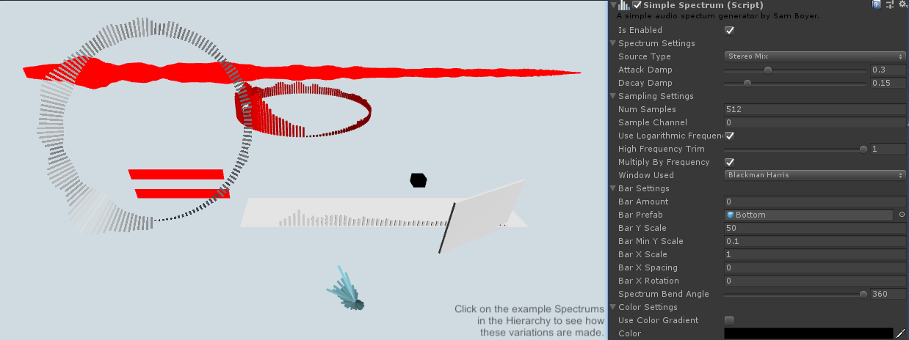

### BandFilter.cs

獨立腳本：https://github.com/pofulu/BandFilter

我根據[這篇教學](https://www.youtube.com/watch?v=mHk3ZiKNH48&t=321s)，並以 SimpleSpectrum 為基礎寫的擴充腳本，可以透過 UnityEvent 輸出 SubBass、Midrange 等等音高的數值，並包含了超過閥值會觸發的 UnityEvent。

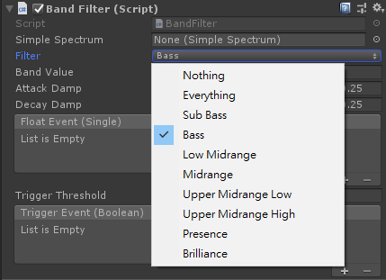

### OSC

可以跟 Ableton Live 雙向溝通，大家應該都有各自的擅長工具了：

keijiro版本：https://github.com/keijiro/OscJack

### keijiro/Lasp

https://github.com/keijiro/Lasp

只能分析**系統當前預設的** Audio Input 所收到的聲音，主打低延遲的 Unity 外部音源接收，**僅能接收外部音源**，沒有認真與 SimpleSpectrum 比較過延遲時間，只能取得 LowPass、BandPass、HightPass 三種音高的數值。

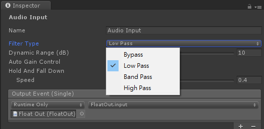

該專案有以下兩個延伸版本：

1. [keijiro/KlakLasp](keijiro/KlakLasp)：跟 Klak 視覺化腳本系統整合，一樣只能接收系統預設的外部音源。
2. [kejiiro/LASP Loopbakc](kejiiro/LASP Loopbakc)：透過 Unity 裡面的 AduioMixer，**讓 Lasp 工具可以分析 Unity 裡面的聲音** ，好處是可以獲得經過 AudioMixer 處理過的聲音數值，可以藉此實現**有視覺效果且靜音**、**有聲音且不輸出效果**等等功能。若使用這個工具，就**沒有辦法收到 Unity 外部的音源**。

## Ableton Live

### LiveGrabber - OSC plugin

https://showsync.info/tools/livegrabber/

用來接收、傳送 OSC 訊號的外掛，解壓縮後會取得等等檔案，可以直接拖進 Ableton Live 的，或是也可以。

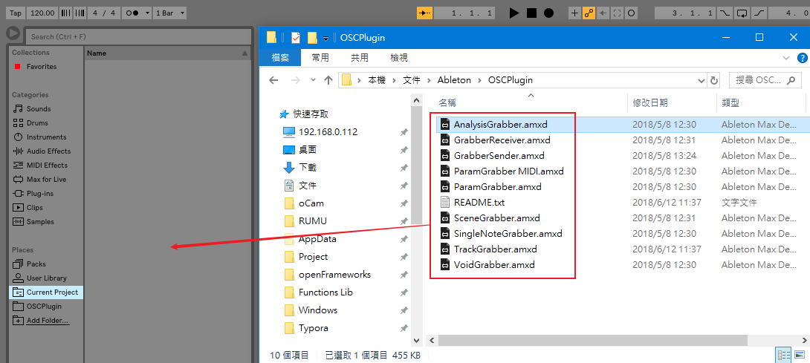

#### 接收訊號示範

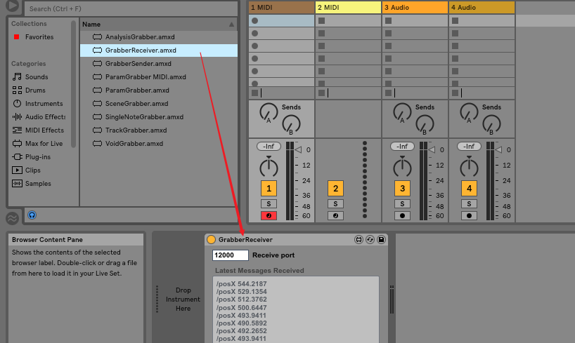

1. 把 GrabberReceiver 拖到任意 Track 底下，以上圖為例是拖到第一個 MIDI Track 底下
2. GrabberReceiver 設定任意接收 port 。接收端不用設定 IP，收到任何訊號都會在底下列出

#### 送出訊號示範

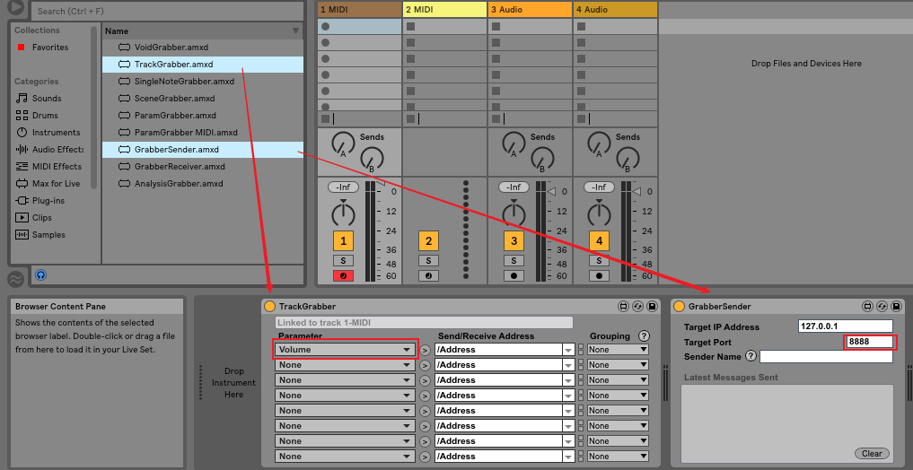

1. 把 GrabberSender 拖到任意 Track 底下，以上圖為例是拖到第一個 MIDI Track 底下
2. GrabberSender  設定任意送出 port，SenderName 留空，接收端以設定本機為例
3. 把 TrackGrabber 拖到任意 Track 底下，以上圖為例是拖到第一個 MIDI Track 底下
4. TrackGrabber 的 Parameter 設定為 Volume，因此會送出第一個 MIDI Track 的音量數值

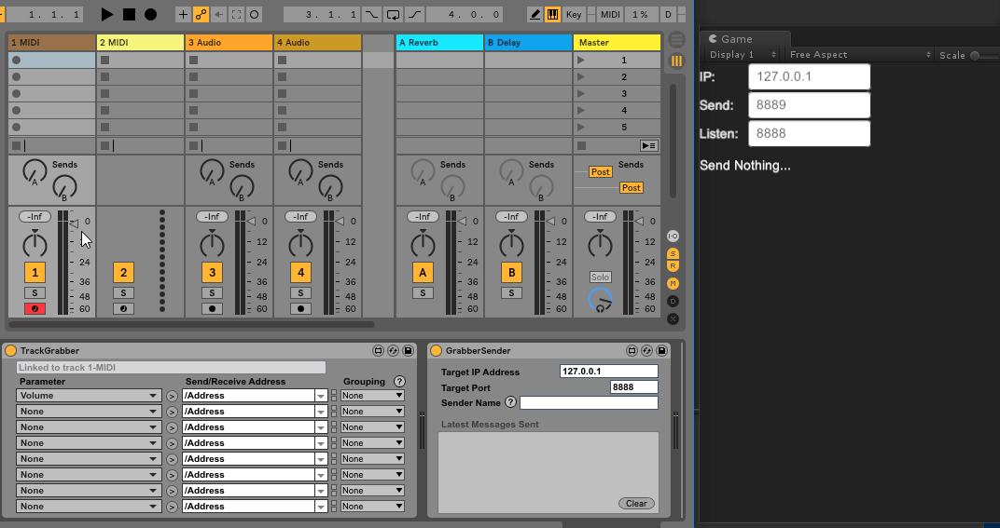

#### 工具說明

##### TrackGrabber

Parameter 欄位會自動抓取該軌道可以用 OSC 接收跟控制的欄位

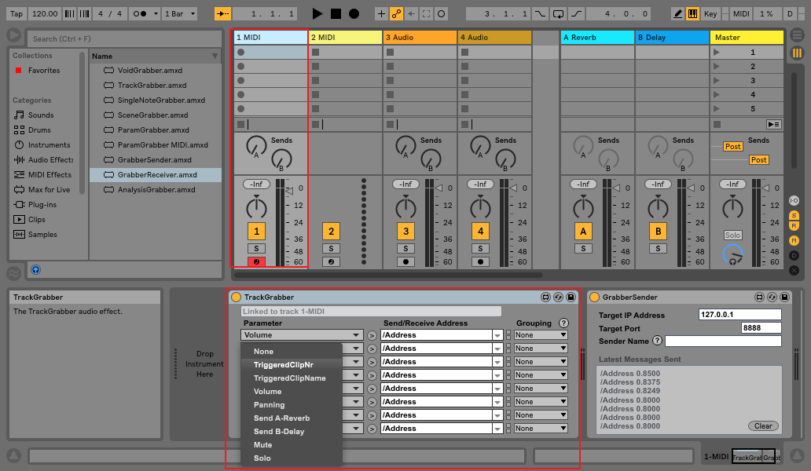

##### ParamGrabber

Paramter 會自動抓取該軌道上的所有效果器可控參數，如果沒有先放上任何效果器，Parameter 的下拉選單會是空的！以下圖為例，Style 跟 Groove 就是對應 Bach 16th 琶音器上的參數。

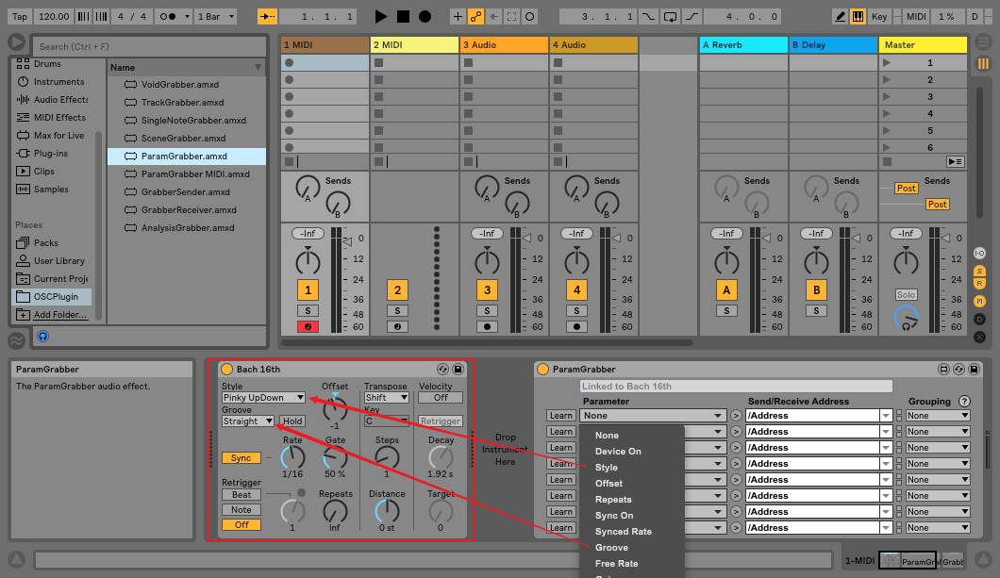

##### AnalysisGrabber

該工具會分析音軌發出聲音，並分析為 Lo、Mid、Hi 三種音高。以下圖為例，如果音軌的聲音符合 Lo 的觸發範圍，Lo 的 Trig 小黃點就會亮起來，可以觸發 Lo Trigger 送出 1 的訊號。如果是 Lo Follower，就可以送出 Lo 分析得到的音量訊號 1~0。三種音高的觸發範圍可以用滑鼠拖動下圖紅框中的位置來調整。幾乎可以用這個工具來做視覺效果了。

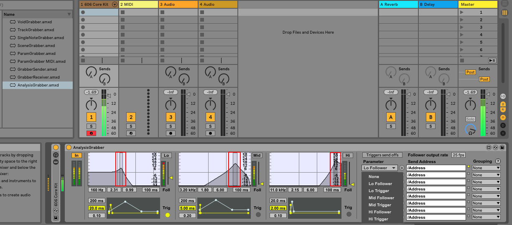

##### VoidGrabber

單純傳輸 0~1 的訊號，跟聲音控制沒有直接關聯

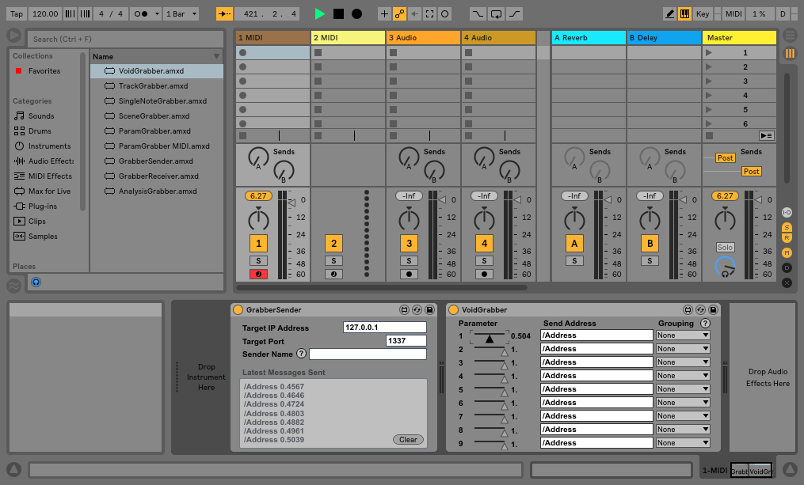

## MIDI

測試機器：AKAI MPK mini

Ableton Live：隨插即用

keijiro/MIDIKlak：不是隨插即用，尚未成功
